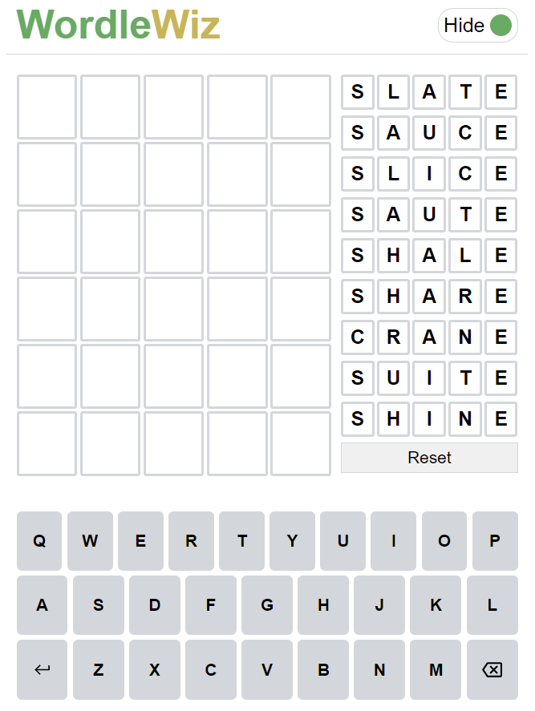
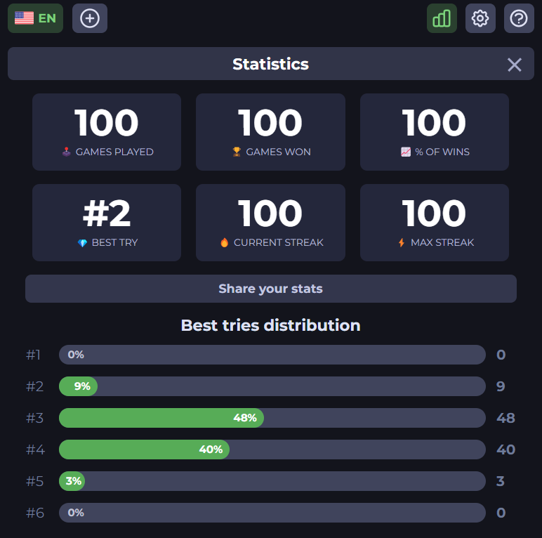

# WordleWiz
WordleWiz provides a list of best words for your next Wordle guess. You can choose the 'Play' to play a game of Wordle too.

## How to use
- Choose the 'Solve' mode from the top right of the page. A list of suggestions appears in the right panel.
- Click on a suggested word to select or type the word out or click on the virtual keyboard keys.
- Then, click on the letters of the word you guessed:
  - Click once, to turn it yellow (answer contains the letter)
  - Click twice, to turn it green (answer contains the letter at the same position)
  - Click thrice, to turn it into white (answer doesn't contain the letter)
- Hit enter to get a new list of suggestion for the next guess based on your choices.
- Click on the 'Reset' button to reset your guesses.
- Choose the 'Play' to play a normal game of Wordle.

## Results

### Total games: 100
### Average guesses: 3.37
### Game Site: https://wordlegame.org/

# Links
- [Optimal Wordle solutions using decision trees (+GitHub)](https://jonathanolson.net/experiments/optimal-wordle-solutions)
- [The best strategies for Wordle (Wiki)](http://sonorouschocolate.com/notes/index.php?title=The_best_strategies_for_Wordle)
- [Letter frequency and Wordle](https://recoveringphysicist.com/39/letter-frequency-and-wordle)
- [Most used letters morse code](https://www3.nd.edu/~busiforc/handouts/cryptography/letterfrequencies.html)
