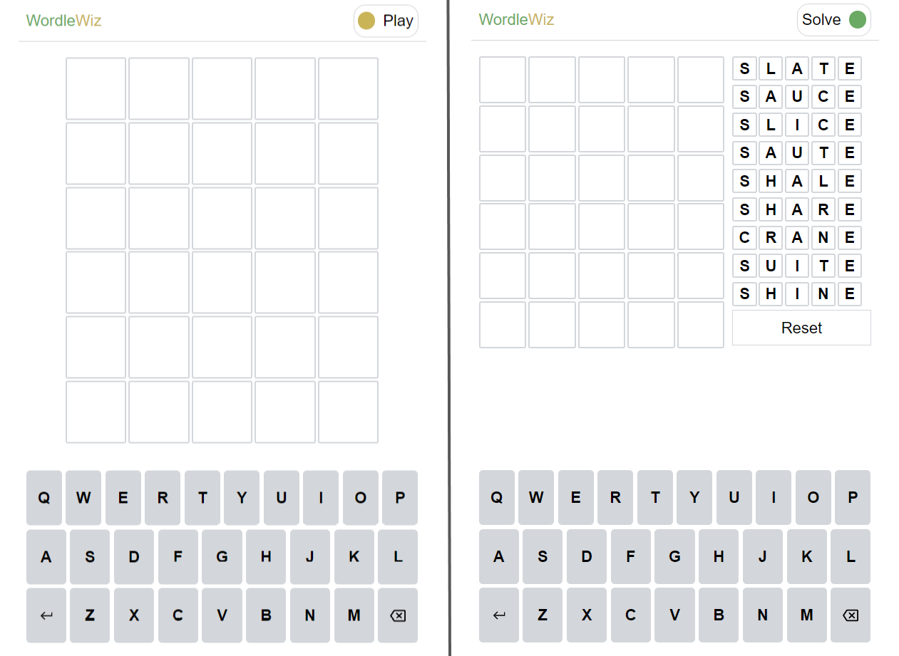

# WordleWiz
WordleWiz provides a list of best words for your next Wordle guess.

## How to use
- Click on a suggested word to select or type the word out with keyboard (or click on the bottom keyboard letters)
- Then, click on the guessed letters:
  - Once, to turn it yellow (answer contains the letter)
  - Twice, to turn it green (answer contains the letter at the same position)
- Hit enter to get the list of suggestion for the next guess
- You can click on the switch to hide the suggestions

## Results

### Total games: 100
### Average guesses: 3.37
### Game Site: https://wordlegame.org/

# Links
- [Optimal Wordle solutions using decision trees (+GitHub)](https://jonathanolson.net/experiments/optimal-wordle-solutions)
- [The best strategies for Wordle (Wiki)](http://sonorouschocolate.com/notes/index.php?title=The_best_strategies_for_Wordle)
- [Letter frequency and Wordle](https://recoveringphysicist.com/39/letter-frequency-and-wordle)
- [Most used letters morse code](https://www3.nd.edu/~busiforc/handouts/cryptography/letterfrequencies.html)
